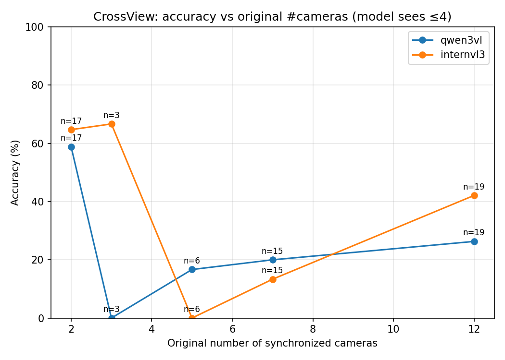
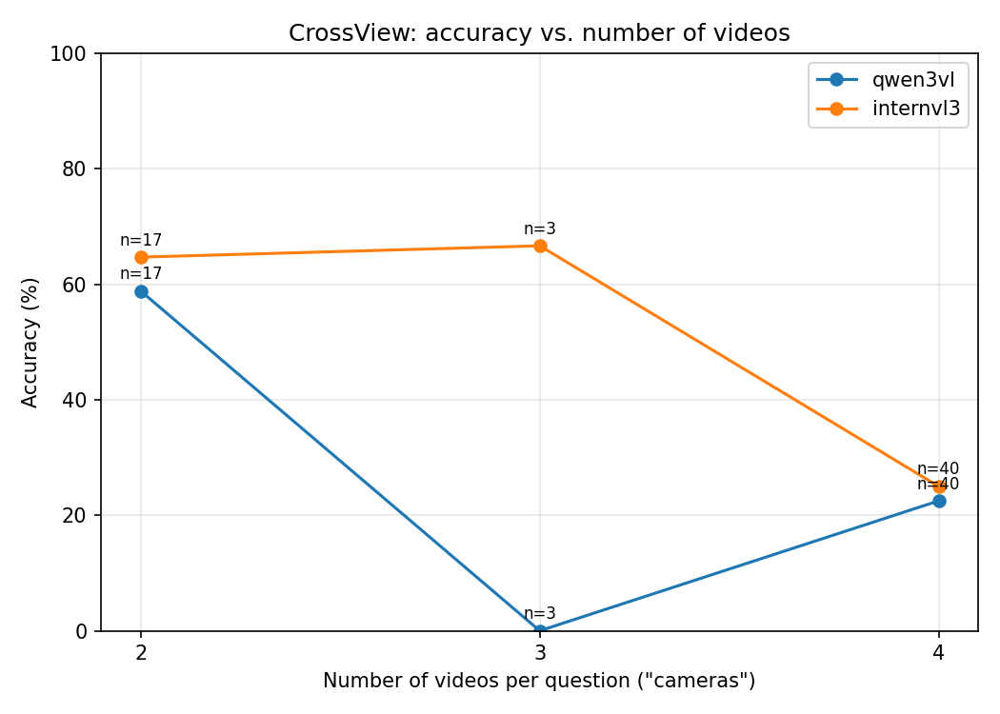
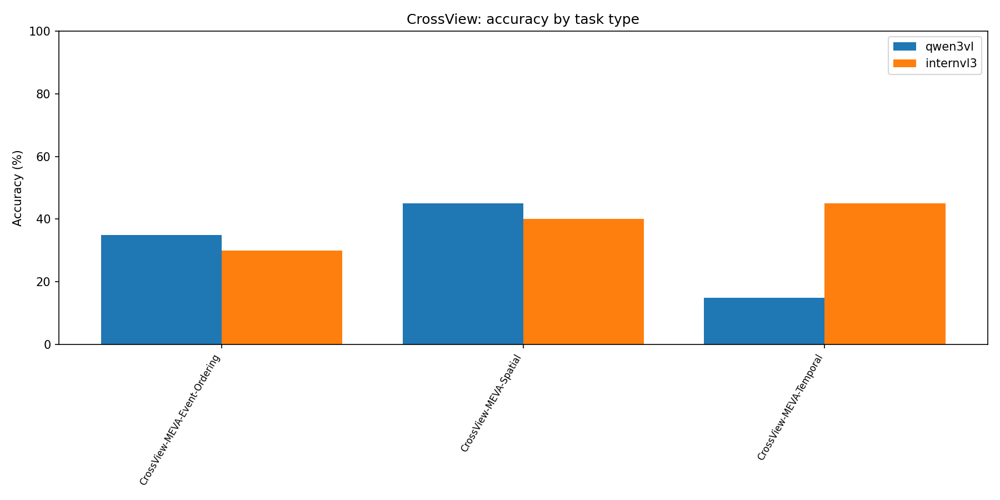

# Multi-Camera VLM Evaluation — Progress Report

**Project:** Benchmarking vision-language models (VLMs) on multi-camera video
understanding, with interpretable failure-mode analysis.
**Harness:** the CVBench two-model "thinking-trace" pipeline (models reason in
`<think>…</think>` before answering, so failures are readable).
**Branch:** `crossview-benchmark`. All file paths below are repo-relative.

> **Important caveat (read first):** the **Qwen3-VL CrossView numbers in this
> report are NOT reliable** — we discovered they are a measurement artifact
> (output truncation + a parser default), described in §6.4. They are being
> regenerated. **InternVL3's numbers are trustworthy.** Do not quote Qwen's
> CrossView accuracy as a capability result until the re-run completes.

---

## 1. TL;DR

- We evaluate two thinking VLMs — **Qwen3-VL-8B-Thinking** and **InternVL3-8B** —
  plus a **blind (no-video) baseline**, on **two separate benchmarks shown
  side-by-side**: **CVBench** (45-question subset) and **CrossView = UT Austin
  SwarmLab "Multi-Camera" VQA** (60-question MEVA subset).
- **Blind baseline = 40%** (18/45) with no video at all — so a meaningful chunk
  of CVBench is answerable from question/option wording alone. Seeing the video
  is worth **+22 percentage points**.
- On the *synchronized* multi-camera benchmark (CrossView), **InternVL3 drops to
  38.3%** and accuracy **degrades as the number of cameras grows** — direct
  evidence that true multi-camera reasoning is hard.
- We completed the three requested analysis tasks (blind exploitation, blind
  sanity check, input-pipeline documentation) — §4.
- We caught a **measurement artifact in the Qwen CrossView run** via adversarial
  verification (§6.4) — a methodological finding in its own right.

---

## 2. Datasets used

| | **CVBench** | **CrossView (UT Austin Multi-Camera)** |
|---|---|---|
| Source | `Dongyh35/CVBench` (HF) | UT Austin SwarmLab "Multi-Camera" VQA ([repo](https://github.com/UTAustin-SwarmLab/Multi-Camera)) |
| Camera relationship | 1–4 **unrelated** clips; question reasons across them | 1–16 **synchronized** cameras of the same scene |
| Full scale | 1,000 QA / 1,315 videos / 15 task types | 6,354 usable QA / 4 sources (MEVA, Ego-Exo4D, AgiBot, nuScenes) |
| **Subset we ran** | **45 questions** | **60 questions** (MEVA only: 20 Temporal + 20 Event-Ordering + 20 Spatial) |
| Camera cap | n/a (≤4 by construction) | capped to **≤4 cameras** (harness limit); `orig_num_cameras` 1–16 retained |

**Why 45 vs 60:** these are two different benchmarks, not one number changing.
CVBench = 45-question subset; CrossView = 60-question subset. CrossView **is**
UT Austin's dataset and it **was** run.

- CrossView converter + subset: `analysis/convert_crossview.py`,
  `analysis/crossview_subset.json` (the curated 60).
- CrossView raw annotations: `crossview-release-annotations/crossview-release/`.
- CrossView videos: 84 MEVA `.avi` clips on disk (licensed; not in git).

---

## 3. Models & harness

| Model | Role | Notes |
|---|---|---|
| **Qwen3-VL-8B-Thinking** | primary thinking VLM | run via `Video-R1/src/eval_thinking.py` |
| **InternVL3-8B** | second thinking VLM | run via `lmms-eval` task `crossview_think` / `mvr_think` |
| **Qwen3-VL blind** | no-video baseline | same prompts, zero visual input (`--no_video`) |

Both models emit visible `<think>` reasoning + an `<answer>` tag, which is what
makes the failure analysis below possible.

---

## 4. The three analysis tasks (done)

### Task 1 — Why does the blind model answer correctly without seeing video? What is it exploiting?
**Status: done.** Files: `analysis/qwen3vl_blind_failures.md` (all 45 traces) +
`analysis/cvbench_multicam_failures.md` §4.1 & §5.1.

The blind model scores **40%** (vs ~31% chance, 62% with video). It exploits:
1. **Distinctively-worded answer options** — on some task types the correct
   option just *sounds* more complete/specific, so it can be picked blind
   (blind got 3/3 Multi-video Attribute Recognition, 2/2 Key-Action Recognition,
   2/2 Video Difference Caption). These are effectively **benchmark artifacts**.
2. **Premise acceptance / yes-bias** — the model treats the question's framing
   as fact. *Example (id 0):* it concluded "both videos show a team scoring in
   the closing moments → Yes" without ever locating a goal.
3. **Language / world priors** about how such scenes usually unfold.

Also notable: **3 questions flip the *wrong* way once video is added** (the model
talks itself out of the right answer), and blind accuracy *declines* as cameras
increase — so the value of actually seeing the video **grows** with more cameras.

### Task 2 — Sanity-check the blind setup so the 40% is trustworthy
**Status: done.** File: `analysis/blind_sanity.md` (backed by
`analysis/inspect_blind.py`, which re-runs the *production* functions).

**Verdict: clean.**
- **Zero vision tokens** — checked the tokenized prompt against the model's own
  9 vision/image/video special tokens across **all 45 prompts**. None present.
- **Zero metadata leakage** — scanned every prompt for filenames, video IDs,
  `_seg` markers, paths, fps, frame counts, timestamps → **0 findings**.
- **40% recounted three independent ways** (stored flags / re-derivation / run
  stdout), 0 mismatches.
- **Honest caveat:** the *questions themselves* reference videos (e.g. options
  literally read "VideoID 1..4"), so the model knows videos *exist* — it just
  gets nothing about their *content*. This is intrinsic to evaluating these
  questions blind, not a pipeline leak.

### Task 3 — Document how video is fed to the models
**Status: done.** File: `analysis/input_pipeline.md` (backed by
`analysis/inspect_inputs.py`, re-running the production samplers).

- **8 frames per video — confirmed in both harnesses** (with `file:line`).
- **Frame sampling differs:** Qwen uses `linspace` (always includes the first &
  last frame); InternVL takes the **midpoint of 8 equal segments** (never
  first/last). Both are uniform and fps-independent.
- **Multiple videos are presented in JSON order (video 1 → 4), each with a
  boundary marker — but in different modalities:**
  - **Qwen:** a **text** marker `"Video 1:"`, `"Video 2:"` … before each clip;
    all vision tokens sit before the question.
  - **InternVL:** literal **marker image frames** rendered "This is video j" /
    "Video j End" wrapping each clip's 8 frames, plus a `Frame1: <image> …`
    scaffold. A 4-video question ≈ **10,300 vision tokens**.
- So the model never sees full video — it sees **8 stills per clip, in order,
  with markers between clips, then the question text.**

---

## 5. Results & graphs

### 5.1 Headline accuracy

| Model | CVBench (n=45) | CrossView (n=60) |
|---|---:|---:|
| InternVL3 | 55.6% (25/45) | **38.3% (23/60)** ✅ trustworthy |
| Qwen3-VL | 62.2% (28/45) | ⚠️ 31.7% (19/60) — artifact, see §6.4 |
| Qwen3-VL blind | 40.0% (18/45) | — |

**CrossView by task type (InternVL3, trustworthy):** Spatial 40% (8/20),
Temporal 45% (9/20), Event-Ordering 30% (6/20).

**CrossView degrades with cameras (InternVL3):** 65% at 2 cameras → 0% at 5 →
13% at 7 → 42% at 12; and 64.7% at 2 videos-seen → 25% at 4. **CVBench does NOT
degrade with #videos** — a useful contrast.

### 5.2 Graphs

CrossView (`analysis/crossview_out/`):
- 
  *accuracy vs the true synchronized-camera count — the strongest "multicam is hard" figure.*
- 
- 
  *(Regenerated from the 2026-06-18 clean re-run: Qwen Event-Ordering is now 7/20 = 35%, not the old 0% artifact — see §6.4.)*

CVBench (`analysis/`):
- `accuracy_vs_cameras.png` (contrast: no degradation), `accuracy_by_task.png`,
  `accuracy_vs_temporal.png`, `temporal_complexity_dist.png`.

> **Graph note (resolved 2026-06-18):** the CrossView graphs have been
> regenerated from the clean Qwen re-run (§6.4); both model series are now
> correct. The old contaminated result is archived as
> `eval_crossview_subset_qwen3vl.json.contaminated-20260615.bak`.

---

## 6. Failure-mode analysis (core deliverable)

All wrong cases were read; quotes are verbatim from the models' own reasoning.
Full traces: `analysis/cvbench_multicam_failures.md` §5,
`analysis/crossview_out/{qwen3vl,internvl3}_failures.md`.

### 6.1 Named failure modes (CVBench)
1. **Premise acceptance / yes-bias** — imports the question framing as evidence.
   *InternVL3 id 0 (gold No→said Yes):* "Since both videos show … a decisive
   goal … the answer is yes" — asserted without locating either goal.
2. **Single-video shortcutting** — answers from one informative clip, ignores the
   rest. *InternVL3 id 197:* "…the only location mentioned in **the video**"
   (singular) on a 2-video fusion question.
3. **Cross-video aggregation failure** (counting / find-the-common-element) —
   each clip is summarized by its *salient* object; the shared non-salient one is
   lost. Almost exclusively at 4 videos. **See the worked example in §7.**
4. **Temporal mis-ordering / given-order bias** — on "order the clips" questions
   both models default to presentation order 1-2-3-4 and invent a justification.
   *InternVL3 was 0/5 on every temporal question in the subset.*
5. **Harness-artifact shortcut** — *InternVL3 id 27:* "'This is video 1' appears
   before 'This is video 2' … therefore video 1 occurred before video 2" — it
   reasoned over the **boundary marker clips**, not the content.
6. **Runaway rumination → token truncation (Qwen3-VL)** — 10/17 Qwen failures
   never produced an `<answer>` tag before the token budget. *(This is the same
   mechanism behind the CrossView artifact, §6.4.)*
7. **Spatial-frame errors across views**, compounded by 8-frame sampling.

### 6.2 Temporal-logic example cases (verbatim, for the poster/talk)
From `analysis/cvbench_temporal_logic_team.json` (+ `analysis/temporal_failures.md`),
verified verbatim. Each carries a temporal-logic (LTL-style) template.

- **id 18** (3 videos): *"What is the correct video sequence for processing
  artifacts?"* A.3-1-2 / B.2-3-1 / **C.2-1-3 ✅** / D.1-2-3. Template
  `F(e1 ∧ F(e2 ∧ F(e3)))`. **Qwen ✅ C**, InternVL ✗ D, blind ✗ A.
- **id 248** (4 videos): *"…correct chronological order of the rescue process…?"*
  gold **D.2-4-3-1** (most scrambled option). **Qwen ✅**, baselines default to
  1-2-3-4 (given-order bias).
- **id 27** (2 videos): *"…did video 1 happen before video 2?"* gold **No**.
  InternVL ✗ — cited the "This is video 1" marker (mode 6.1.5).

### 6.3 CrossView failures (InternVL3, trustworthy)
InternVL3 answered all 60 cleanly. Weakest on Event-Ordering (30%) and Spatial
(40%); accuracy collapses at higher original-camera counts (0% at 5 cameras).
Full traces: `analysis/crossview_out/internvl3_failures.md`.

### 6.4 ⚠️ Methodological finding — the Qwen CrossView "0%" is an artifact
We adversarially verified the striking "Qwen 0/20 on Event-Ordering" with four
independent checks. Conclusion: **it is a measurement artifact, not a capability
result.**

- **All 20** Event-Ordering outputs were **truncated at the 2048-token budget**
  (~8,500 chars, ending mid-sentence) — **none emitted an `<answer>` tag.**
- With no tag, the parser fell back to *"the first A/B/C/D token anywhere in the
  text"*, which is just the article "a" in prose → **`prediction="A"` for all 20
  is a parser default, not a model choice.**
- **Gold is C (×16) or D (×4), never A** → 0/20 was **mechanically guaranteed.**
- The traces show Qwen **genuinely attempting** to order events (one was
  converging on the *correct* answer when cut off) — so it's "ran out of room,"
  not "can't do it."
- **This contaminates Qwen's other CrossView scores too:** the gold key is
  A-heavy on Spatial (16/20) and Temporal (12/20), so the fallback-"A" scored
  *spuriously correct*. Of Qwen's 19 "correct" CrossView answers, **only 3 came
  from a real parsed answer** (10 Spatial + 6 Temporal were fallback flukes; every
  *tagged* Temporal answer was actually wrong).
- **Not a global bug:** InternVL3 parsed all 60 cleanly; Qwen parsed fine on its
  shorter Spatial/Temporal outputs.

**Fix — DONE (2026-06-18 re-run).** Raised Qwen's generation budget 2048 → 8192
(`run_eval_crossview.sbatch --max_new_tokens 8192`) and hardened the parser to
**abstain** on a tagless/truncated trace instead of defaulting to "A." Result of
the clean re-run (`eval_crossview_subset_qwen3vl.json`; old file archived as
`*.contaminated-20260615.bak`):

- **54/60 outputs now emit `<answer>`** (was 0/20 on Event-Ordering); only 3 abstain.
- **Event-Ordering 7/20 = 35%** — the model genuinely orders events; the 0/20 is gone.
- Spatial 9/20 (45%), Temporal 3/20 (15%) — the previously fluke-inflated scores
  corrected downward to their real values.
- Predicted-letter distribution is now diverse (A 15 / B 7 / C 15 / D 20 / abstain 3),
  no longer the A-spike of the parser default.
- **Overall is still 31.7% (19/60) — but by coincidence**, on a completely different,
  legitimate set of correct answers. Report this number; it is now trustworthy.

---

## 7. Input frames for a failure case (worked example: id 57)

**Task:** Joint-video Counting, 4 videos. **Gold = 4. Qwen said 3.**
Trace: *"Videos 1, 2, and 3 all prominently show beverages. Video 4 does not have
beverages prominently displayed."* → cross-video aggregation failure (mode 6.1.3).

The 8 frames the model actually saw per clip (`analysis/failure_examples/`):

| Video 1 | Video 2 | Video 3 | Video 4 (the "gotcha") |
|---|---|---|---|
|  |  |  |  |

**Why it failed:** Videos 1–3 show beverages as *store displays*; Video 4's
beverages (a gallon OJ jug + bottles) are **inside the shopper's cart**, not on a
display. The model pattern-matched "beverage display" from the first three clips
and discounted the in-cart evidence in Video 4.

Also available for a synchronized view of all four clips:
- `analysis/failure_examples/id57_joint_counting_grid2x2.mp4` (2×2 grid)
- `analysis/failure_examples/id57_joint_counting_stitched.mp4`

*(Note: the `failure_examples/` media is currently untracked in git; the images
above render when viewing this file inside the repo.)*

---

## 8. Status & next steps

- **Done:** both benchmarks wired + run; the 3 analysis tasks; failure-mode
  catalog; graphs; adversarial verification of the Qwen artifact.
- **In progress:** Qwen CrossView re-run with the budget + parser fix (§6.4);
  this will replace the Qwen graph series and accuracy numbers.
- **Deferred (by design):** ego-exo4d + other CrossView sources (this run is
  MEVA-only); the >4-camera ("N-camera") harness extension for the full 1–16
  curve; a larger temporal subset (only 5 temporal questions in the CVBench
  subset, so per-level accuracy is anecdotal — the full set has 130).

## Appendix — where everything lives

| Item | Path |
|---|---|
| Blind exploitation (task 1) | `analysis/qwen3vl_blind_failures.md`, `analysis/cvbench_multicam_failures.md` §4.1/§5.1 |
| Blind sanity check (task 2) | `analysis/blind_sanity.md` (+ `inspect_blind.py`) |
| Input pipeline (task 3) | `analysis/input_pipeline.md` (+ `inspect_inputs.py`) |
| CrossView results | `analysis/crossview_out/`, `Video-R1/src/r1-v/eval_results/eval_crossview_subset_qwen3vl.json` |
| Graphs | `analysis/crossview_out/*.png`, `analysis/*.png` |
| Failure traces | `analysis/crossview_out/{qwen3vl,internvl3}_failures.md`, `analysis/cvbench_multicam_failures.md` §5 |
| Failure input frames | `analysis/failure_examples/` |
| Poster asset index | `analysis/poster_assets.md` |
| Temporal-logic question data | `analysis/cvbench_temporal_logic_team.json` |
